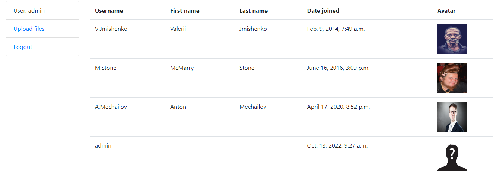
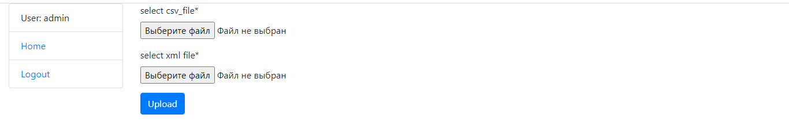

## Installation

Python must be already installed

```shell
git clone https://github.com/DanRoman-code/task_cxdojo.git
python -m venv venv
source venv/bin/activate (on Linux and macOS) or venv\Scripts\activate (on Windows)
pip install -r requirements.txt
python manage.py makemigrations
python manage.py migrate
python manage.py createsuperuser
python manage.py runserver
```
## Demo






